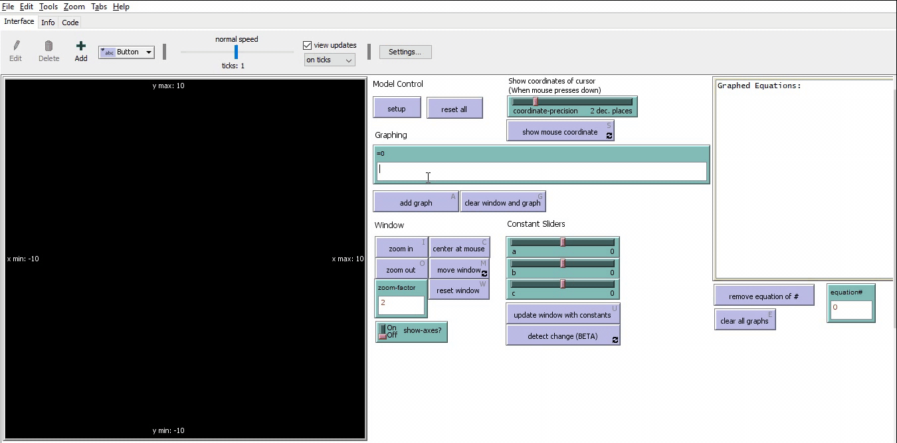

# Grapher

To use/view the NetLogo models, you need to [download NetLogo](https://ccl.northwestern.edu/netlogo/).

`grapher.nlogo` - most complete; graphing calculator, able to graph \*most\* implicit graphs

_\*most\* because equations like x^3+y^3+1=3xy (or its translational variants) are hard to get exactly right even in desmos._

`fn-grapher.nlogo` - graphing calculator, only supports graphing functions. This is the most complete version before the implicit grapher.

# Grapher Usage

This is for the implicit grapher (`grapher.nlogo`) only, though `fn-grapher.nlogo` was the predecessor and works similarly, but with less features.

## WHAT IS IT?

This is a general-purpose graphing calculator. It is intended to visualize how algebraic graphs would look like. This calculator is able to graph implicit equations, which is any equation that can be written as 0 = \*. (With some exeptions, which are documented in the KNOWN BUGS AND MISFEATURES section)

## HOW TO USE IT

Before doing anything, `setup` the model. This will initialize all the necessary features and the visual area.

Use `reset all` to reset all the inputs, sliders, and internal states of the graphing calculator to their default values.

### GRAPHING

To graph an equation, put the equation in the input bar named `=0` and hit `add graph`.

The equation box will keep track of all graphed equations. When there is a error in the syntax of the equation, it will also show up in there, giving some important details about the error.

Use `clear window and graph` instead of `add graph` if you want to remove all previously graphed equations and only graph the one in the `=0` input bar.

`remove equation of #` will remove one equation based on its index. The index is the number in the `equation#` input bar. The corresponding equation can be looked up in the equation box above.

`clear all graphs` will clear all graphed equations, but will not reset any window settings.

### Syntax of Equation

Put the equation in the form of "0 = \*" and leave out the "0 =" part. Currently this is the only way to obtain a correct graph.

For example, to graph the equation "y ^ 2 + x ^ 2 = 100", type `y ^ 2 + x ^ 2 - 100`.

To graph a function, simply put in the function and add `- y` in the end.
For example, to graph the function "y = x + 4", type `x + 4 - y`.

The calculator requires equations to be put in the format of a Netlogo expression. For the usage of this model, this means that many expressions might look different from a typical math print.

Some important things to note about operators and syntax:

- Use basic arithmetic operators as usual, such as `+`, `-`, `*`, `/`
- Use `^` for exponentiation, where "10 ^ 2" means 10 squared
- Use the _log_ keyword followed by the number, and then the base, with one space in between. For example, "log 64 2" means log of 64 to the base 2, which is 6.
- Put a space around each operator and numberical value
- _π_ and _e_ are predifined. To use them, type in `pi` or `e`
- Netlogo provides trigonometric functions, but they are in degrees
- "x" and "y" follow the conventional meaning of algebra
- DO NOT type in any equation without both "x" and "y", and the calculator will not graph anything if you do this.
  - Theoretically, 0 is not equal to anything except for 0, so "0 = a" where a is anthing not 0, will not produce a graph, since it's a true statement. "0 = 0" will produce a graph that's true for every x and y. These are not meaningful graphs, so the calculator avoids them

If an error occurs when the program tries to graph the equation, the error will show up in the **Graphed Equations** box, and the program will make a beep sound.

For more imformation, including some limitation in numbers, refer to the [Math section in Netlogo's Programming Guide](https://ccl.northwestern.edu/netlogo/docs/programming.html#math)

### WINDOW

Window refers to the visual area of the calculator.

There are several operations available on the window, `zoom in`, `zoom out`, `center at mouse`, `move window`, and `reset window`.

When the mouse(cursor) is in the window, `zoom in` and `zoom out` will use the mouse as the center. If the mosue is not in the window, they will zoom using the center of the window.

When mouse is in window, `center at mouse` will set the mouse coordinate as the new center for the window. If the mouse is not in the window, `center at mouse` does nothing.

`reset window` will reset the window settings to the default values, including the zoom and center of the window.

All the zooming features zoom by the `zoom-factor`.

Turn `show-axes?` off if you don't want to see the x- and y-axes in the window.

The window shows its boundaries with _x min_, _x max_, _y min_ and _y max_. These values will change when you zoom or move the window.

The colors of window background, graph, and axes can be customized. To do this, scroll down and change the color in the input bar, and then press `update window`.

### CONSTANT SLIDERS

**Constant Sliders** provide a way to include letter constants into the equation. When you include one of the letters, you can control the graph with the slider.

`update window with constants` will reflect the change of the slider value in all graphs.

To change the minimum, maximum, or the increment step of the sliders, scroll to the bottom of the calculator, and change the corresponding value. When finished, press `update constant sliders`.

`detect change` (BETA) will automatically detect any change in the slider value and update the equation based on the new value. At this point, this feature is not stable.

<!---
## THINGS TO NOTICE

(suggested things for the user to notice while running the model)

--->

## THINGS TO TRY

<!---
(suggested things for the user to try to do (move sliders, switches, etc.) with the model)
--->

Try some interesting equations.

- `5 * e ^ (-1 * ((x / 5) ^ 2)) - y` (bell curve)

- `x - y ^ 2` (sideways parabola)

- `x - 2 ^ y` (logarithm)

- `sin(100 * x) - cos(100 * y)` (grid)

- `sin(100 * x) - 2 * cos(100 * y)` (waves?)

## EXTENDING THE MODEL

<!---
(suggested things to add or change in the Code tab to make the model more complicated, detailed, accurate, etc.)
--->

- Use different colors for consecutive graphs, automatically.
- Optimize `move window` and the zoomimg features

<!---
## NETLOGO FEATURES

(interesting or unusual features of NetLogo that the model uses, particularly in the Code tab; or where workarounds were needed for missing features)
--->

## KNOWN BUGS AND MISFEATURES

- Functions like `floor`, `round`, `mod`, produces a continuous graph, which is unexpected.
- Square root functions and logarithmic functions can be very slow, and may show an incomplete graph
  - A workaround for logarithmic function is to do exponentiation on y (e.g. instead of 2 ^ x - y = 0, type x - 2 ^ y = 0)
- Odd root functions only produce half of the graph that they are supposed to produce, in addition to being very slow
- Equations that contain exponentiation with a negative power will not work

## CREDITS AND REFERENCES

Inspiration from Peter Brooks, at Stuyvesant High School. He solved most of the problems in this model.
