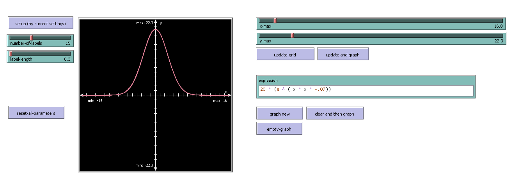
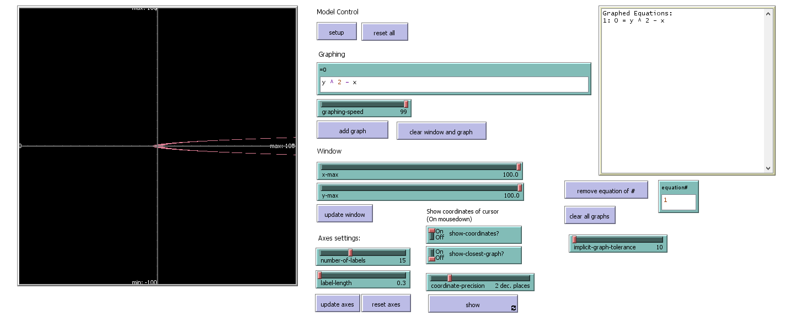
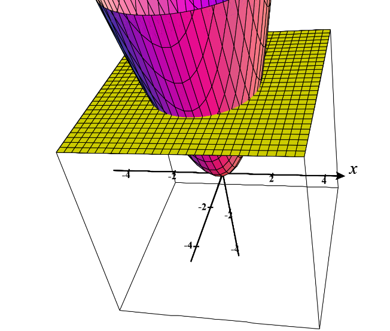
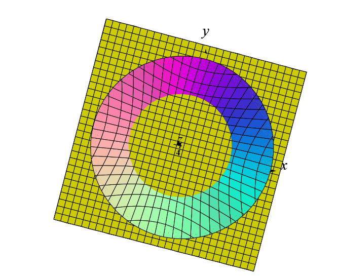

# First Project: Making `grapher`

https://github.com/ruoshui-git/grapher/blob/main/grapher.nlogo

`grapher` is my graphing calculator, written in NetLogo.

# What is NetLogo?

NetLogo is a "multi-agent programmable modeling environment", in which commands are entered to control "observer" and 3 other agent-sets (turtles, patches, links) to run a simulation and draw graphics on screen.

# Motivation

When I took Intro CS, I had some previous experience, so I asked my teacher Mr. Brooks if there's something interesting that I could do.

## Initial Idea

In a NetLogo program:

1. Draw the grid and axis for a Cartesian (xy) plane.
2. Have a 2 sliders, each controlling 1 coefficient of a parabola.
3. Have a turtle draw the graph and change the sliders while drawing, and see what interesting images can come out in the end.

## What I did

I offered to write a NetLogo program that can graph arbitrary functions. I wanted to see what's possible with the limited string parsing abilities of NetLogo.

# Building Function Grapher

As it turned out, I didn't need any string parsing. NetLogo allows for `eval`uating NetLogo expressions. I have the user enter the equation of the graph as an expression, and prepend `[x] ->` to make that an `anonymous reporter` (aka an anonymous `function`) with the argument `x`, and just run it repeatedly from the left to right, supplying the `x` value and setting the return value as `y`, and them plotting `(x, y)` on the screen, and connecting 2 adjacent dots with a straight line. When I make the interval of `x` small enough, the graph looks pretty good. (But it does make discontinuous functions look weird.)


--_My initial funtion grapher._

It was relatively easy compared to what came later. Initially, `sin` and `cos` weren't behaving correctly, but it was fixed after changing some NetLogo setting.

# Building Implicit Equation Grapher

Then I started to wonder if it's possible to graph arbitrary implicit equations. It's the same as a "relation," but written in the form of `0 = [equation]`. This allows for complicated graphs that allows operations on both `x` and `y`.

Desmos can do it _really fast_.
Mr. Brooks thought that desmos can do this because it does some heavy processing in the server. I showed him that the graphing is in fact done in the browser. That pursuaded him that this is probably achievable.

## Initial Idea

At first, along with some other math teachers, Mr. Brooks said it looked like we have to use gradient fields (or something like that, I can't remember). I didn't know what it was, so according to him, all I had to do was to "learn some calculus". The idea was to find a point on the graph, and then calculate in which direction the graph would "move", and have a turtle follow that path and draw on it.

The problem with this approach is that many graphs are not continuous. Some can have multiple parts, or multiple "pathes" like the following graph, and the algorithm wouldn't know which path to follow. It can follow every path, but then where would it end drawing?


--_Graph of `sin(x) = cos(y)`, which poses a problem to the "following path" idea._

## My implementation

Before doing anything more, I needed to refactor some code. Now I accepted an expression that accepts both `x` and `y` in it.

And instead of prepending `[x] ->` to the expression from the user, now I prepend `[x y] ->` so both `x` and `y` are taken into account.

Not understanding the algorithm anyway, my first desperate attempt (done over winter break) was to assign a `(x, y)` to each each patch (pixel) according to their location on the screen. For each patch, calculate if their `(x, y)` fit in the equation (`= 0`). If it does, then the point is on the graph.

But an exact equal comparison produces almost nothing. (It's almost never exact, because the details that can be represented by `patches` are finite.) So an approximation is needed. The `epsilon` (or what Mr. Brooks called `tolerance`), is defined via a user-controlled slider.


--_Implicit graph with a `tolerance` of 1._
<br><br><br>

--_Implicit graph with a `tolerance` of 10._

The problem here is that different graphes need different `tolerance`s, since some points might be closer to the actual theoretical point, while others are theoretically faraway, but still is physically the closest.

Some times even different parts of a graph need different `tolerance`s.

And we thought that nothing could be done to improve that. For a while.

## My Thought Journey

(Images included here, apart from my own program, are taken from CalcPlot3D and Desmos. I didn't think to use them originally when I was thinking about these. But they're included here to demonstrate what I'm talking about.)

After winter break, Mr. Brooks told me that what I was doing was taking a cross section of the 3D graph with the plane `z = 0`. My equations were in the form of `0 = [equation]`. If I were to use another number on the left hand side, it would give me the cross section at a different height.

I thought he meant that there was something wrong about it. I thought about that for a long time.

So do they all make sense together? Here's what I thought about over the next few days:

If I were to graph `z = x^2 + y^2`, it would look like a cone that opens upward, except for the the body is round. From the side, it should look like a parabola (since as `z` increases, `y` increases on the order of squares).


--_`z = x^2 + y^2` intersecting `z=0`._

If I slice the graph with `z = 0`, I get a dot, because that's the tip of the 3D shape. As `z` increases, the plane will intersect thicker parts of the 3D shape, producing larger circles.



--_`z = x^2 + y^2` intersecting `z=4`._

And this makes sense when I interpret the equation just as graphing a 2D circle, since it's just increasing `r`, the radius, in `r^2 = x^2 + y^2`.



--_`z = x^2 + y^2` intersecting `z=4`, viewing from the top. It's easier to see here that the cross section is a larger circle._

However, the 3D shape here is only above or on `z = 0`, so if I move the plane down (where `z < 0`), I would see nothing because the plane and the 3D shape wouldn't intersect. It works with the circle definition because a circle with radius less than 0 will not produce any graph.

So I thought that they are coherent. I then talked to Mr. Brooks about this. He said there was nothing wrong. It's just the way that I was implementing graphing reminded him of that slicing process.

Then the graphing problem here becomes, how do we know if a point is at the intersection of the plane `z = 0` and the 3D shape?

Just as I was going to leave the office on that day, he realized that if a point on the 3D shape intersects with the plane `z = 0`, then the values around it should have opposite signs (+-) when plugged into the equation, meaning that some are above the plane, some are below.


--_Graph of `z = 2 - x^2 - y^3`. Notice that for a point to be at the boundary, some neighbors have to be above `z = 0`, some below._


--_Graph of `0 = 2 - x^2 - y^3`; The cross section of `z = 2 - x^2 - y^3` at `z = 0`._

And in NetLogo, if we compute `z` for every `patch` and compare with `z` of the neighboring `patches`, we can know if the point is on the graph.

## New Implementation

The actual implementation first computes a `z` for all `patches` from their assigned `(x, y)`. Then it checks that if the `z` value of the current `patch` is above the plane. If it is, and any neighboring `patch` is below the plane, then we can say that the current `patch` is "on the graph".

With that, here's my viable product:


--_Graph of `sin(xy) = cos(xy)`._

The algorithm was really difficult to come up with. But the implementation was _really_ easy. Here's the implementation of the core algorithm:

```netlogo
; graph the given equation: equation (as anonymous reporter)
to graph-implicit [ equation ]
  ;; reset patches state
  ask patches
  [
    set on-graph? false
  ]

  ;; compute and store height to the surface
  ask patches
  [
    carefully
  [
      set wzcor (runresult equation wxcor wycor)
    ]
    [
        ;; error catching code
    ]
  ]

  ;; graph all valid patches
  ask patches with [wzcor != false]
  [
    ifelse wzcor = 0
    [ set on-graph? true]
    [
      if wzcor > 0
      [
        if any? neighbors with [ wzcor != false and wzcor < 0 ]
        [ set on-graph? true ]
      ]
    ]
  ]

  ask patches with [on-graph?]
  [ set pcolor graph-color ]

end
```

And I added other features, such as resizing and panning the window, changing colors, etc, which are relatively easy to reason about, but involves much more coding.

# Known Bugs

NetLogo limitations exist. But those aren't interesting.

Here's an interesting one: in junior year Calculus class, we talked about a weird equation:

`x^3 + y^3 + 1 - 3xy = 0`

This graph has a single point at `(1, 1)` and a line running somewhere else. Only at `(1, 1)` the graph is on the cross section. All points around it are above the plane, no points are below.


--_Graph of `x^3 + y^3 + 1 - 3xy = z`. The shape "kisses the plane" `z = 0` at `(1, 1)`._

Turns out that even Desmos cannot graph that dot accurately:


--_Graph of `x^3 + y^3 + 1 - 3xy = 0`. There should be a point at `(1, 1)`, but it's not graphed._

And my calculator on default settings just happens to check `(1, 1)`, so it actually graphed that point.


--_Graph of `x^3 + y^3 + 1 - 3xy = 0` in my calculator. Do you see that dot?_

A transformed version, (e.g. via translation), however, will not show correctly.
But since even Desmos can't do this, I'm good with what I have now.

# Ideas for Improvement

- Currently resizing and panning the window requires _all_ equations to be computed and graphed fresh. It would be nice if I can somehow cache the results and reuse them in future computation.
- Show different graphs with different colors, like Desmos.
- There's something called NetLogo Web that loads a NetLogo model in the browser. However, it's still a work in progress, and slower compared to the desktop version. I want to contribute to it by porting the CoffeeScript engine to WebAssembly compiled from Rust. Maybe it can make the app a bit more accessible.

# More

Just as I was finishing up this writeup, I found a new problem. While the algorithm I'm using is amazing, it ignores cases where the two parts of the 3D shape switch over from one side of the `z = 0` plane to the other, without intersecting the plane at all.


--_Graph of `z = 1 / (x + y)`._

This should not produce any graph, but it shows up in my calculator where the boundary-switch happened.

Graph of `0 = 1 / (x + y)`:


--_Graph of `0 = 1 / (x + y)` in my calculator. The slant line is caused by the shift in the sign of the `z` values, but the graph never crosses `z=0`._

But desmos handles it correctly:


--_Nothing is shown on the screen, because the equation doesn't produce a graph._

But now, maybe I can take into account how the graph is behaving near the boundary (going towards infinity vs 0) to determine if it's a legitimate boundary crossing or a weird tele-transportation.
